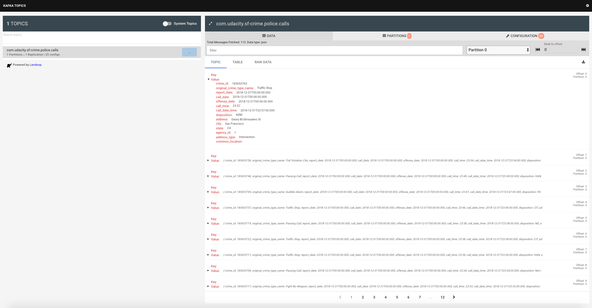
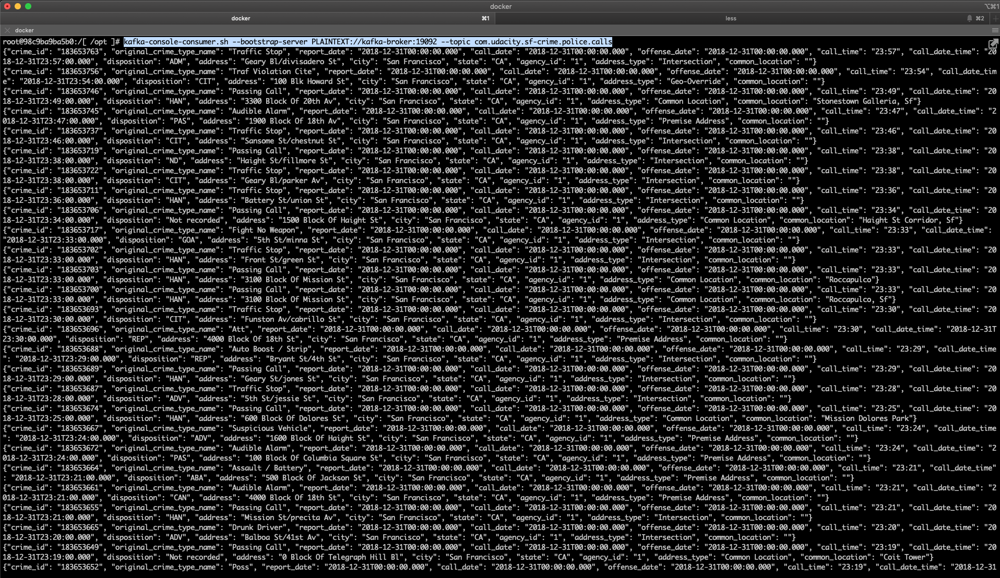
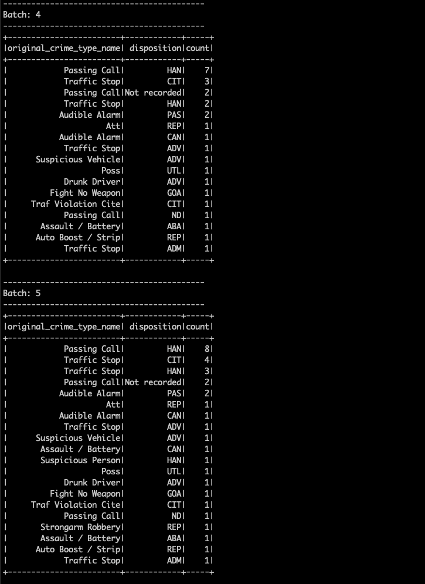
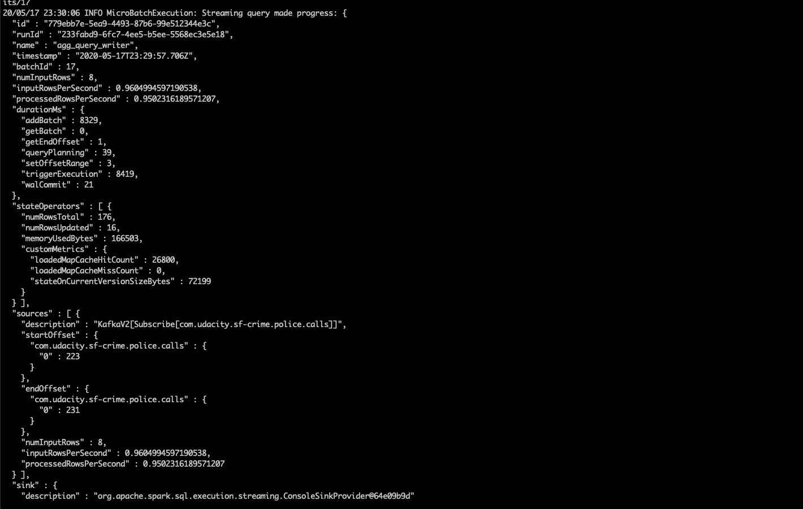
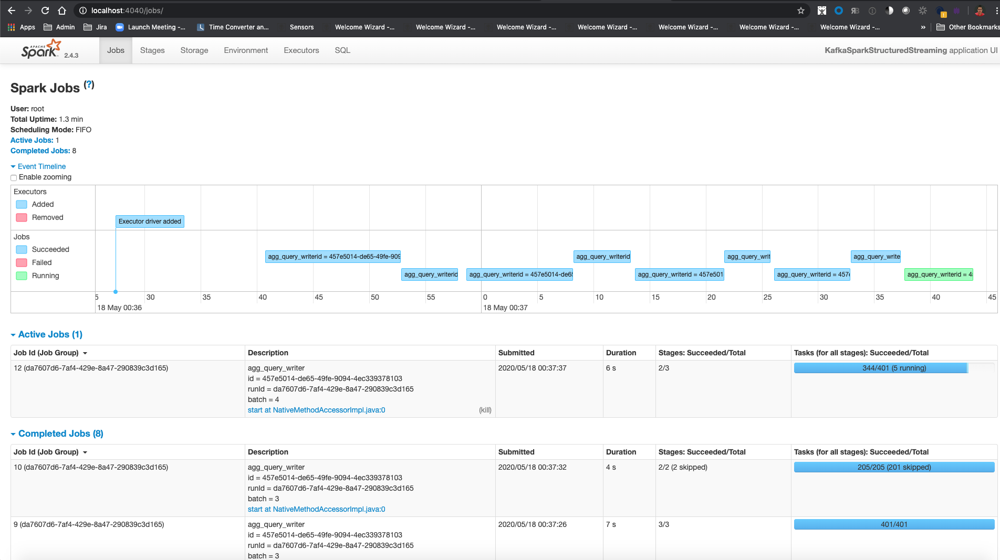

# SF Crime Statistics with Spark Streaming

In this project, you will be provided with a real-world dataset, extracted from Kaggle, on San Francisco crime incidents, and you will provide statistical analyses of the data using Apache Spark Structured Streaming. You will draw on the skills and knowledge you've learned in this course to create a Kafka server to produce data, and ingest data through Spark Structured Streaming.


## Prerequisites

The following are required to complete this project:

* Docker
* Python 3.7
* Access to a computer with a minimum of 16gb+ RAM and a 4-core CPU to execute the simulation (Not Windows)

## Directory Layout
The project consists of two main directories, `kafka` and `sparks`.

```
├── README.md
├── __init__.py
├── docker-compose.yaml
├── kafka
│   ├── kafka_server.py
│   ├── producer_server.py
│   └── resources
│       └── police-department-calls-for-service.json
├── requirements.txt
├── screenshots
│   ├── aggregation-batch.png
│   ├── kafka-console-consumer-topic-data.png
│   ├── kafka-topics-topic-data.png
│   ├── progress-reporter.png
│   └── spark-ui.png
└── spark
    ├── data_stream.py
    └── resources
        └── radio_code.json
```

## Running and Testing

To run the simulation, you must first start up the Kafka and Spark ecosystem utilizing Docker Compose.

```%> docker-compose up```

Docker compose will take a 3-5 minutes to start, depending on your hardware. Please be patient and wait for the docker-compose logs to slow down or stop before beginning the simulation.

Once docker-compose is ready, the following services will be available:

| Service | Host URL | Docker URL |
| --- | --- | --- |
| Kafka | PLAINTEXT://localhost:9092 | PLAINTEXT://kafka-broker:9092 |
| REST Proxy | [http://localhost:8881](http://localhost:8881/) | http://rest-proxy:8881/ |
| Landoop Kafka Topics UI | [http://localhost:8885](http://localhost:8885) | http://topics-ui:8885 |
| Spark Master | [http://localhost:8080](http://localhost:8080/) | http://spark-master:8080 |
| Spark Worker 1 | [http://localhost:8081](http://localhost:8081/) | http://spark-broker:8081 |
| Spark Worker 2 | [http://localhost:8082](http://localhost:8082/) | http://spark-broker:8082/ |
| Spark UI | [http://localhost:4040](http://localhost:4040/) | http://spark-master:4040/ |

### Step 1
* The first step is to build a simple Kafka server.
* Complete the code for the server in producer_server.py and kafka_server.py.

#### To run the `Kafka Server`:

1. Go to the root folder of the project
2. `virtualenv venv`
3. `. venv/bin/activate`
4. `pip install -r requirements.txt`
5. `python kafka/kafka_server.py`

#### To verify the results:

Connect to Kafka Topics and verify the topic is being populated with data


You can check the topic data by looking at kafka-console-consumer



### Step 2
Apache Spark already has an integration with Kafka brokers, so we would not normally need a separate Kafka consumer. However, we are going to ask you to create one anyway. Why? We'd like you to create the consumer to demonstrate your understanding of creating a complete Kafka Module (producer and consumer) from scratch. In production, you might have to create a dummy producer or consumer to just test out your theory and this will be great practice for that.

* Implement all the TODO items in data_stream.py. You may need to explore the dataset beforehand using a Jupyter Notebook.
* Connect to spark-master:
    ```
    docker exec -it sf-police-spark-master bash
    ```
* Do a spark-submit using this command:
    ```
    /spark/bin/spark-submit --packages org.apache.spark:spark-sql-kafka-0-10_2.11:2.4.3 --master localhost[*] /tmp/udacity/data_stream.py
    ```
* Take a screenshot of your progress reporter after executing a Spark job. You will need to include this screenshot as part of your project submission.

    

    

* Take a screenshot of the Spark Streaming UI as the streaming continues. You will need to include this screenshot as part of your project submission.
    
    
    
### Step 3

#### How did changing values on the SparkSession property parameters affect the throughput and latency of the data?
    
    Fine tuning the SparkSession configuration based on the topology of your cluster could improve drastically the performance. 
    In order to verify that the configurations are actually improving the performance we can check the `processedRowsPerSecond` 
    in the progressReporter. 


#### What were the 2-3 most efficient SparkSession property key/value pairs? Through testing multiple variations on values, how can you tell these were the most optimal?
    
    Based on the course lectures about performances and the references posted in there I focused on the following 
    configurations to try to improve the value of `processedRowsPerSecond`
    - spark.streaming.kafka.maxRatePerPartition: You can set this parameter to change the max number of messages per partition
        and increase it checking that the cluster cpu, load and memory won't blow up.
    - spark.executor.memory and spark.executor.memory: Increasing the heap memory will help to improve the speed processing 
        drastically as long as we don't go over 32 gb that will cause performance issues with GC.
    - spark.default.parallelism: According to the documentation the optimal value is to configure this to 2 or 3 tasks 
        per core in the cluster.