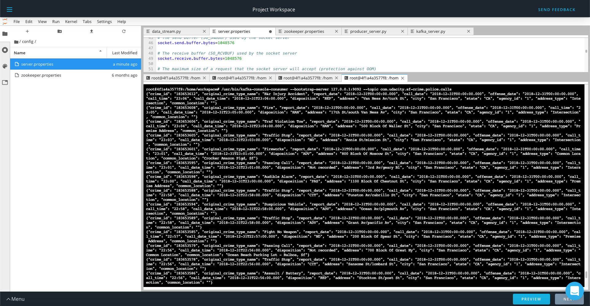
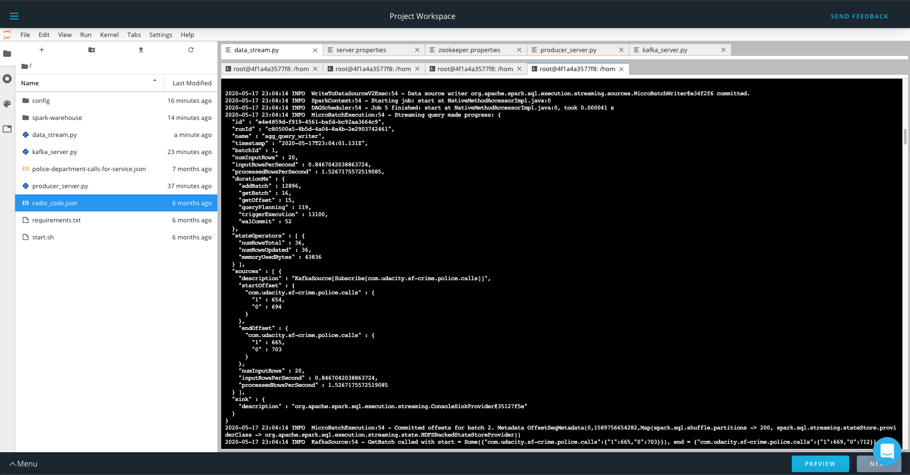
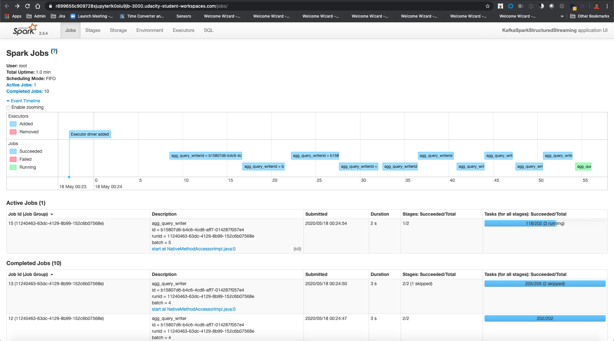

# SF Crime Statistics with Spark Streaming

In this project, you will be provided with a real-world dataset, extracted from Kaggle, on San Francisco crime incidents, and you will provide statistical analyses of the data using Apache Spark Structured Streaming. You will draw on the skills and knowledge you've learned in this course to create a Kafka server to produce data, and ingest data through Spark Structured Streaming.


## Directory Layout
All the main files are on the root level. The config folder contains the Kafka properties and the Screenshot folder contains
the requires screenshots for this course.

```
.
├── README.md
├── config
│   ├── server.properties
│   └── zookeeper.properties
├── data_stream.py
├── kafka_server.py
├── police-department-calls-for-service.json
├── producer_server.py
├── radio_code.json
├── requirements.txt
├── screenshots
│   ├── batch.png
│   ├── kafka-console-consumer.png
│   ├── progress-reporter.png
│   └── spark-ui.png
├── screenshots.zip
└── start.sh

```

## Beginning the Project

This project requires creating topics, starting Zookeeper and Kafka servers, and your Kafka bootstrap server. 
You’ll need to choose a port number (e.g., 9092, 9093..) for your Kafka topic, and come up with a Kafka topic name 
and modify the zookeeper.properties and server.properties appropriately.


## Running and Testing
Modify the zookeeper.properties and producer.properties given to suit your topic and port number of your choice. 
Start up these servers in the terminal using the commands:
```
bin/zookeeper-server-start.sh config/zookeeper.properties
bin/kafka-server-start.sh config/server.properties
```


Install requirements using the provided ./start.sh script. 
This needs to be done every time you re-open the workspace, or anytime after you've refreshed, or woken up, or reset data, or used the "Get New Content" button in this workspace.


## Step 1
The first step is to build a simple Kafka server.
Complete the code for the server in producer_server.py and kafka_server.py.

To start kafka-consumer-console, use the command /usr/bin/kafka-consumer-console

Take a screenshot of your kafka-consumer-console output:


## Step 2
Apache Spark already has an integration with Kafka brokers, so we would not normally need a separate Kafka consumer. However, we are going to ask you to create one anyway. Why? We'd like you to create the consumer to demonstrate your understanding of creating a complete Kafka Module (producer and consumer) from scratch. In production, you might have to create a dummy producer or consumer to just test out your theory and this will be great practice for that.
Implement all the TODO items in data_stream.py. You may need to explore the dataset beforehand using a Jupyter Notebook.
Do a spark-submit using this command: 
```
spark-submit --packages org.apache.spark:spark-sql-kafka-0-10_2.11:2.3.4 --master local[*] data_stream.py.
```

Take a screenshot of your progress reporter after executing a Spark job

Take a screenshot of the Spark Streaming UI as the streaming continues


    
### Step 3

#### How did changing values on the SparkSession property parameters affect the throughput and latency of the data?
    
    Fine tuning the SparkSession configuration based on the topology of your cluster could improve drastically the performance. 
    In order to verify that the configurations are actually improving the performance we can check the `processedRowsPerSecond` 
    in the progressReporter. 


#### What were the 2-3 most efficient SparkSession property key/value pairs? Through testing multiple variations on values, how can you tell these were the most optimal?
    
    Based on the course lectures about performances and the references posted in there I focused on the following 
    configurations to try to improve the value of `processedRowsPerSecond`
    - spark.streaming.kafka.maxRatePerPartition: You can set this parameter to change the max number of messages per partition
        and increase it checking that the cluster cpu, load and memory won't blow up.
    - spark.executor.memory and spark.executor.memory: Increasing the heap memory will help to improve the speed processing 
        drastically as long as we don't go over 32 gb that will cause performance issues with GC.
    - spark.default.parallelism: According to the documentation the optimal value is to configure this to 2 or 3 tasks 
        per core in the cluster.